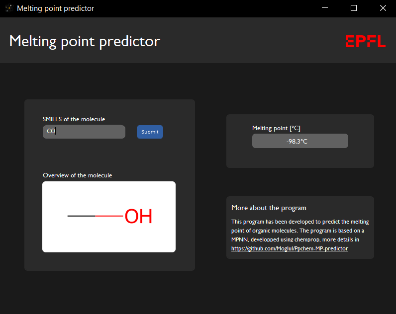

# Melting point predictor
[](https://) [](https://) [](https://)
## :wrench: Installation

1. Install [Conda](https://conda.io/projects/conda/en/latest/index.html)
2. Fork the repository, open a shell and clone it
```
git clone https://github.com/Moglul/Ppchem-MP-predictor.git
```
3. Create and activate the Conda environment
```
conda create -n <env_name> python=3.8
conda activate <env_name>
```
4. Go to the repository folder and install all required librairies
```
cd <path_of_repository>
pip install -e .
```

## :clipboard: About the project

This melting point predictor was developed as part of a project in the course of practical programming in chemistry at EPFL. It only applies to organic molecules and returns melting points with a mean absolute error on the test split of 36.1°C.

Various featurizations and prediction models have been tried out (see [notebooks](https://github.com/Moglul/Ppchem-MP-predictor/tree/main/notebooks)), the final model is based on a message passing neural network from [chemprop](https://github.com/chemprop/chemprop). 

This project combines various cheminformatics methods, such as machine learning, web-scraping and molecular visualization but also the development of a graphical interface, allowing everything to be grouped into an easy-to-use software.

## :computer: Usage
There are two ways to use the program. It's possible to launch it through a graphical interface which allows visualization of the molecule at the same time. But it is also possible to launch only the predictor without any interface.

The program requires the SMILES of the molecule in question to predict its melting point. Once the SMILES is entered, the prediction starts and in the case of the interface, the visualization of the molecule appears in the dedicated area. It's important to write the SMILES according to the regulations.

### Launching Windows interface 
Open a shell and paste the following lines
```
cd ../Ppchem-MP-predictor/src/MP_predictor_project
python GUI_windows.py
```

### Launching MacOs interface
Open a shell and paste the following lines
```
cd ../Ppchem-MP-predictor/src/MP_predictor_project
python GUI_mac.py
```

### Launching on a shell
Open a shell and paste the following lines
```
cd ../Ppchem-MP-predictor/src/MP_predictor_project
python NO_GUI_predictor.py
```

<br />
Here is an image showing the interface under Windows, the example of methanol has been taken. A melting point of -98.3°C is predicted, the actual melting point of methanol is -97.6°C.
<br><br><br>
<p align="center">
  
  <br>
  <em>Figure 1: Screenshot of the interface with example of methanol.</em>
</p>